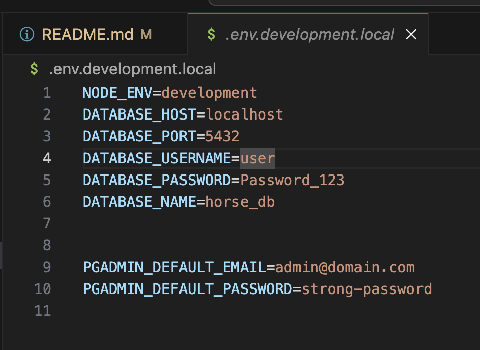
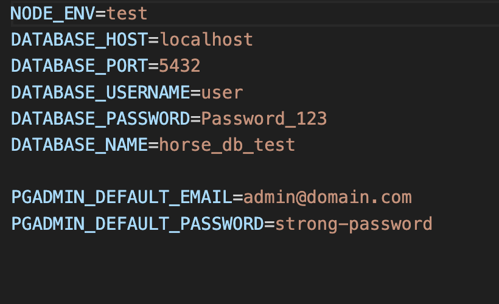
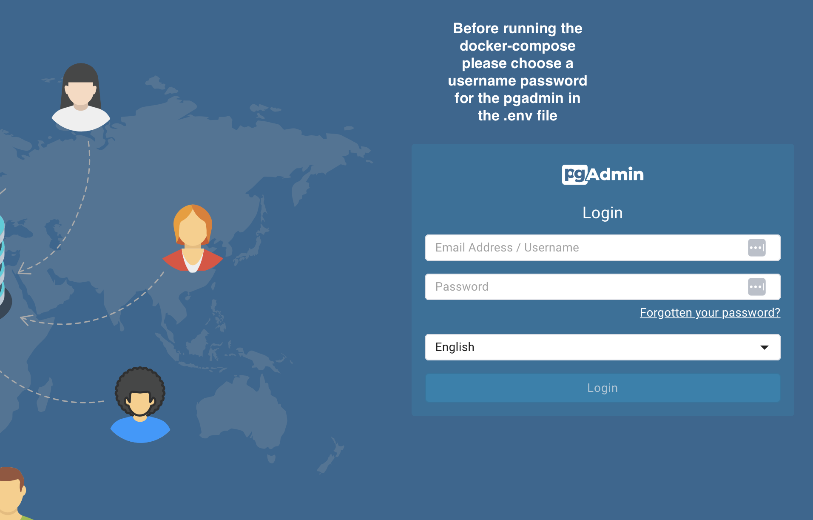
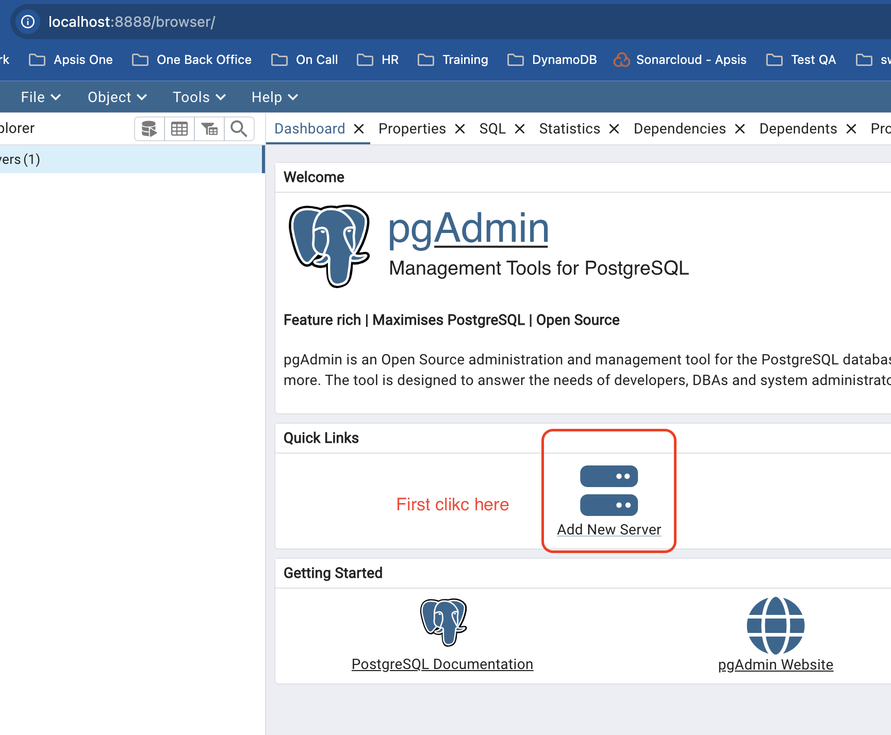
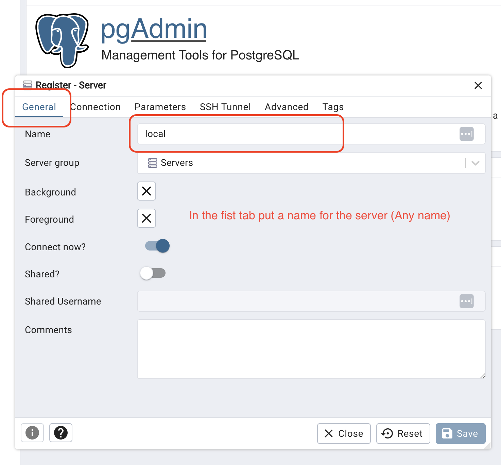
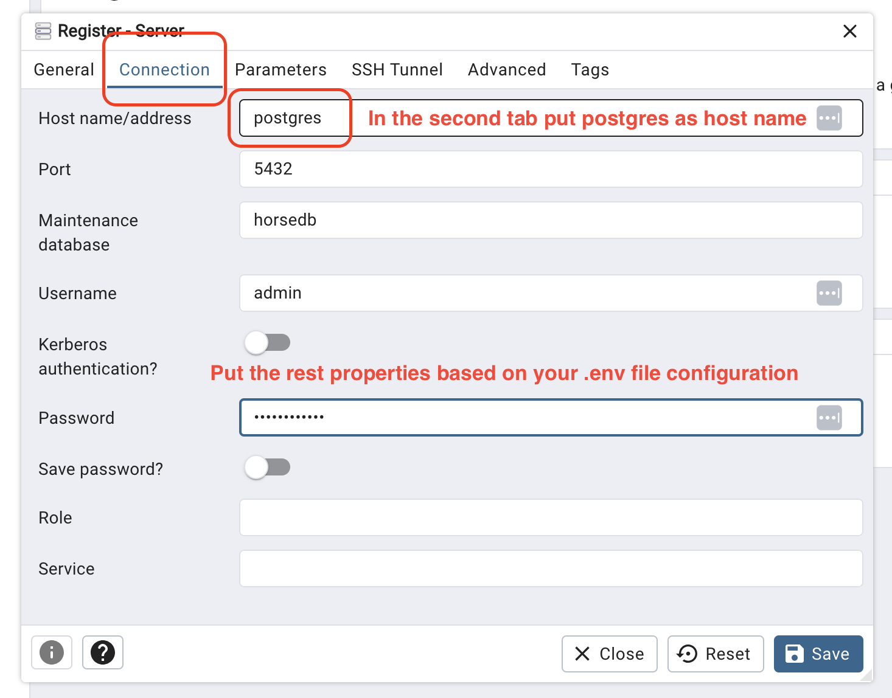
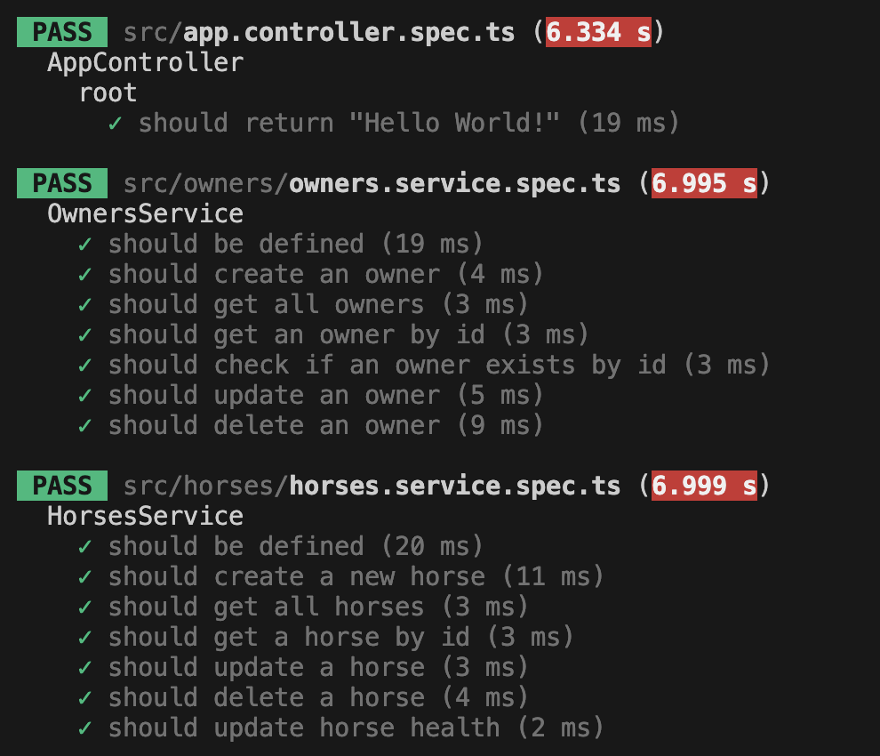
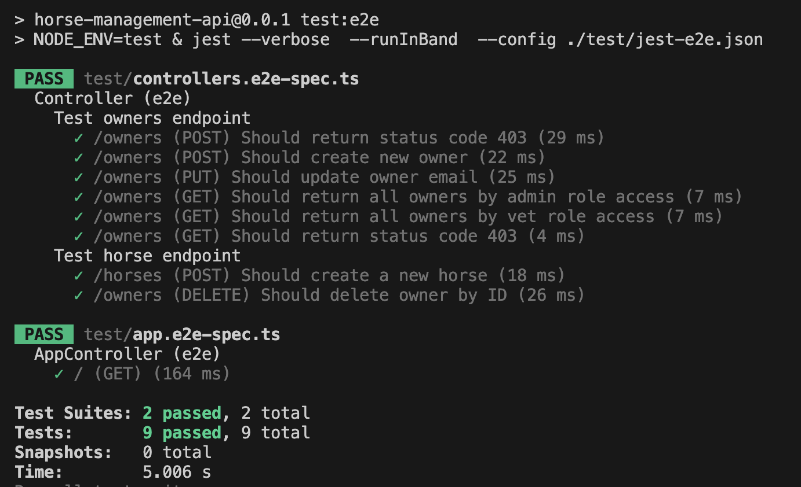
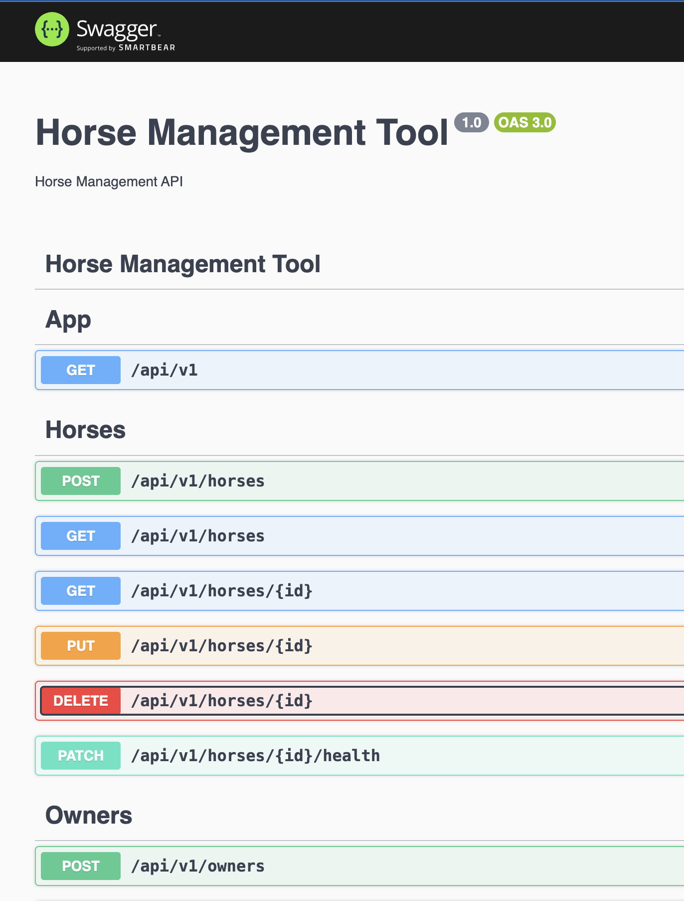

# Horse management Api

The Horse Management System API is a backend service designed to efficiently manage horse records and their associated owners with role-based access control (RBAC). The system ensures that users can only access and modify data according to their assigned permissions. It provides secure endpoints to create, update, delete, and retrieve horse information while maintaining data integrity and user authorization.

## Technologies

- **NestJS**: A progressive Node.js framework for building efficient, reliable, and scalable server-side applications.
- **TypeScript**: A strongly typed programming language that builds on JavaScript.
- **Swagger**: A tool for documenting APIs.
- **Jest**: A delightful JavaScript testing framework with a focus on simplicity.
- **TypeORM**: An ORM for TypeScript and JavaScript (ES7, ES6, ES5) that supports many database systems.

## Database

- **PostgreSQL**: A powerful, open-source object-relational database system with a strong reputation for reliability, feature robustness, and performance.

## Installation

1. Clone the repository:
   ```bash
   git clone https://github.com/HamidRezaeirad/horse-management-api.git
   ```
2. Navigate to the project directory:
   ```bash
   cd horse-management-api/backend-service
   ```
3. Install the dependencies:
   ```bash
   npm install
   ```

## Database Config

Please configure `.env.development.local`, and `.env.test.local` based on `.env.example.local` file

```
NODE_ENV=development|test
DATABASE_HOST=Database hot
DATABASE_PORT=Database port
DATABASE_USERNAME=Database user
DATABASE_PASSWORD=Database password
DATABASE_NAME=Dtabase name

PGADMIN_DEFAULT_EMAIL=PG admin user
PGADMIN_DEFAULT_PASSWORD=PG admin password
```

## .env.development.local Config



## .env.test.local Config



## pgadmin Config


<br>

<br>

<br>


If database does not exists create both dev and test databases:

```
CREATE DATABASE DATABASE_NAME
```

## Docker Compose

To run PostgreSQL and pgAdmin using Docker Compose, follow these steps:

1. Useing the `docker-compose.yml` file in the root of this project with the necessary configuration for PostgreSQL and pgAdmin.
2. Start the services using Docker Compose.
3. Access pgAdmin by navigating to `http://localhost:8888` in your browser and log in with the specified credentials.
4. Connect to the PostgreSQL database in port `5432` using the credentials provided in the `.env.development.local` file.

   ```bash
      docker compose --env-file .env.development.local up
   ```

## Running the Project

1. Start the development server:
   ```bash
   npm run start:dev
   ```
2. The API will be available at `http://localhost:3000`.

## Running Tests

```bash
# Eslint
$ npm run lint

# unit tests
$ npm run test

# e2e tests
$ npm run test:e2e

# test coverage
$ npm run test:cov
```

## Unit test


<br>

## e2e test



## Swagger Documentation

1. Start the development server:
   ```bash
   npm run start:dev
   ```
2. Open your browser and navigate to `http://localhost:3000/api-docs` to view the Swagger documentation.



## Postman Docs

You can find the Postman collection in the `postman-docs` folder. This collection contains predefined API requests that you can use to test and interact with our API endpoints.
